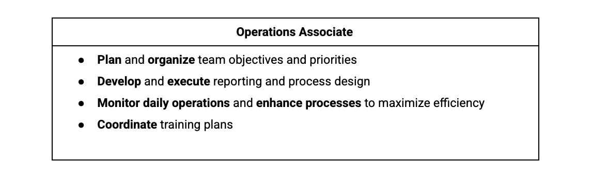

# Using buzzwords in your job search
______
You now know how to start searching for project management jobs! Job searching can be a time of self-reflection, growth, and excitement. Add a career path change into the mix, and it can also seem intimidating. We are about to give you some tips to help you in your job search efforts, including introducing you to some common buzzwords and skills that commonly appear in job descriptions.

**Using buzzwords and skills in your job search**

 

In the last video, you learned about buzzwords—words or phrases that are popular for a period of time or in a particular industry. In today’s job market, buzzwords like data-driven, team player, and self-starter are common. You may see terms like these show up throughout your searches. 

Similarly, many job descriptions list the specific skills they require candidates to have. These skills can become some of the terms that you use in your job search. Examples of these skills include: 
* Coordination, or getting people and teams to work together. You may see responsibilities in job descriptions such as “coordination of efforts to achieve project deliverable” or “coordinate internal resources to ensure successful project completion.” Being a project manager is essentially managing the coordination of resources to achieve your end goal. Coordination is one of the top skills a project manager should have, so searching for this term can lead you to appropriate positions. 
* Organization, or the ability to stay focused on different tasks. You may come across phrases like “solid organizational skills, including attention to detail and multitasking skills” or something as simple as “highly organized.” Organization is key to being a great project manager. We will discuss many ways to sharpen this skill in the upcoming lessons.
* Leadership, or being able to lead a group of people. You may see phrases like “strong leadership qualities” or “ability to lead” in job descriptions. You are working on many of the skills needed to become a great leader in this program!
 

You may also come across positions in your search that do not include the title “Project Manager” or any of the job titles we previously discussed, but you shouldn’t rule these positions out. In many cases, the job description will include project management experience and expectations, but the position may be called something else entirely. 
 
Look at some of the job responsibilities required for a position titled “Operations Associate” This position is a type of project manager. You will find that most project management-related job descriptions call for the ability to plan, organize, monitor, and execute tasks—all skills you will be able to do once you complete this certification.

**Common project management buzzwords**
Including buzzwords and skills in your job search can help you find jobs that are ideal for you and your skill set. Once you have found a position you want to apply for, listing buzzwords and skills that are relevant to the position can also help recruiters and hiring managers identify you as a qualified and knowledgeable candidate. 

Some common project management-related buzzwords and skills you could include on your resume are:

* Analytical
* Assertive
* Assessing outcomes
* Assessing progress
* Attention to detail
* Conflict resolution
* Collaborative
* Coordination
* Communication
* Development
* Evaluation
* Executing plans
* Financial analysis
* Impact assessment
* Leadership engagement
* Managing meetings
* Managing client expectations
* Managing conflicts
* Managing relationships with stakeholders
* Managing vendors
* Meeting deadlines
* Monitoring
* Multitasking
* Planning
* Prioritizing
* Problem-solving
* Process development
* Process improvement
* Project Coordination
* Project implementation
* Project initialization
* Project planning
* Project reporting
* Quality control
* Risk assessment
* Risk management
* Solution development
* Strategic planning
* Strong interpersonal skills
* Strong verbal communication
* Strong written communication

**Key takeaway**
Job searching for your first (or next) project management position can be easier if you enter the right search terms. Search for the skills you’re learning throughout this project management certificate program or skills you’ve acquired in your current or previous positions. These terms will help you determine if you have found a potential match. As you start your project management career, don’t let the requirement for project management experience stop you from applying for project management-adjacent roles. Once you have completed this certification course, you'll see how many skills you already have that can be translated and correlated to a project management role.