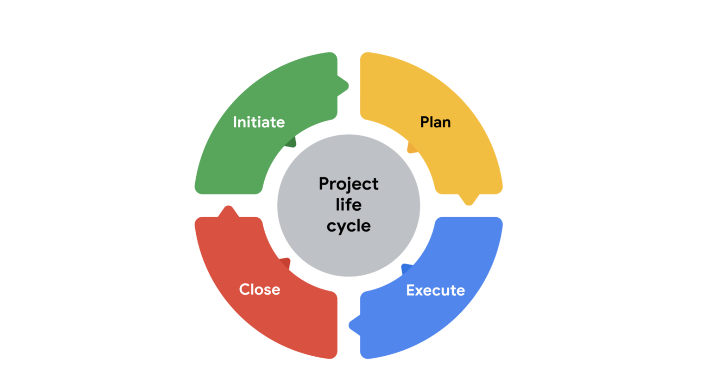

# Case study: The significance of each project phase

### The consequences of rushing through a project phase
It’s a Friday night, and Jason, a project manager at a company that specializes in virtual reality software, is out to dinner with some friends. He receives a text message from his manager, Bonita, that says, “911! Call me!” When Jason calls Bonita, she tells him she needs a cost and timeline for a virtual reality training program for Flight Simulators, Inc., a company that does aircraft maintenance, by the end of the weekend.

Jason spends the weekend working through a proposal for Flight Simulators, Inc. He quickly throws together a proposal estimating that it will cost $200,000 and take six weeks to develop the course. This is the standard cost and time frame for developing training on his company’s platform. He sends the proposal over to Flight Simulators, Inc. so that he can meet their deadline. 

Monday morning, Jason walks into the office, and Bonita tells him that she got reprimanded for not following the company’s process for building out a proposal and including the engineers in the process. The engineers take a look at the information presented by Flight Simulators, Inc. and realize that the company’s software won’t work with their platform. It will take six months to develop their platform to meet the needs of the organization’s software and another six months to test the software and platform integration. The cost to develop and test this software will be over a million dollars.  

This project has failed before it even started. There’s no way to complete the request from Flight Simulators, Inc. without impacting the budget, quality, and timeline.  

### What should have happened
Instead of dropping everything to meet Bonita’s request, Jason tells Bonita that while he understands that she wants to make the customer happy by getting them a proposal promptly, it is important to take the time to get the proposal right. He tells Bonita that he will draft up an email to Flight Simulators, Inc. and request additional time to develop an accurate and reasonable proposal. Bonita is hesitant but agrees. 

Monday morning, Jason sees that Flight Simulators, Inc. has responded to his request. They appreciate the fact that he communicated his concerns about the quick turnaround on the proposal request. They said they would give him a week to work with his team to provide an estimate for the project.  

Now Jason has the time to get all of the key players involved in estimating the effort it will take to complete the project, including the cost, schedule, and resources. 

Let’s apply the project life cycle to this project. 

Circular graphic showing how the project life cycle phases fit together. Initiate, plan, execute, and close.
#### Initiating the project
This is the phase Jason rushed through in the first scenario. Ideally, in this phase, Jason discusses project goals with Flight Simulators, Inc. to gain a clear understanding of what they are asking for. Once Jason has defined the project goals, he can gather the stakeholders and project team members to define what needs to be done to successfully create this training for Flight Simulators, Inc. Jason identifies the skill sets required, the timeline, and the cost to develop the training. He identifies and documents the value that this project creates for the company. He presents all of the information he has put together to his company’s leadership team, who approves Jason’s proposal. Jason then submits the proposal to Flight Simulators, Inc., and they accept it. 

#### Making a plan
Now that Jason has the green light to work on the project, he makes a project plan to get from start to finish. Having a plan in place ensures that all team members and stakeholders are prepared to complete their tasks. Jason outlines the important deadlines and tasks for the project to be successful. He creates a schedule to account for all resources, materials, and tasks needed to complete the project. 

#### Executing and completing tasks
During this project phase, Jason’s project team puts his plan in motion by executing the work. Jason monitors his team as they complete project tasks. His role as the project manager is not to complete the individual tasks but to help break down any barriers that would slow or stop the team from completing their tasks. It is also Jason’s responsibility to communicate schedule and quality expectations. Jason uses his communication skills to keep Flight Simulators, Inc. up to date on the project status and gather feedback from them. This keeps the project on schedule and within budget.

#### Closing the project
Jason’s team has successfully completed the training, and he delivers it to Flight Simulators, Inc. They are very pleased with how it turned out! Jason is now ready to close this project and move on to the next one. Before he closes this chapter, Jason and his team discuss and document the lessons learned from the project. What worked well, and what could work better next time? Jason also puts together a small lunch gathering for his team to celebrate and recognize their hard work. 

#### Key takeaway
It may seem like a lot of work to go through an entire project life cycle, but the long-term impact it will have on your project is huge! It is your job as the project manager to make sure that your leadership truly understands the risk of not properly preparing for a project. Making assumptions that are incorrect can put your company at risk. Instead, taking the time to carefully initiate, plan, execute, and close your project leads to project success and good working relationships with customers.  