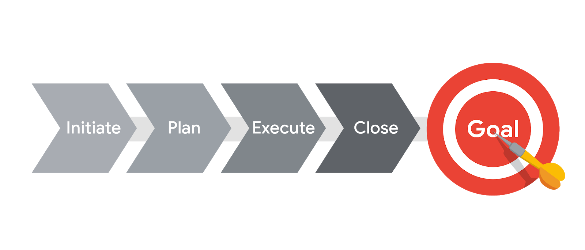

# Summary of the project phases
The project life cycle is the path for your project from start to finish. Each project phase builds toward the subsequent phase and helps to create a structure for the project. To recap, the main phases of the project life cycle are: initiating the project, making a plan, executing and completing tasks, and closing the project. 

In this reading, we will summarize each phase of the project life cycle. 

From left to right, this graphic shows each phase of the project management lifecycle as arrows, pointing to a target (goal).
## The project life cycle
### Initiate the project
In this phase, ask questions to help set the foundation for the project, such as:

* Who are the stakeholders?
* What are the client’s or customer’s goals?
* What is the purpose and mission of the project?
* What are the measurable objectives for the team?
* What is the project trying to improve? 
* When does this project need to be completed? 
* What skills and resources will the project require? 
* What will the project cost? What are the benefits?
* 
## Make a plan
In this phase, make a plan to get your project from start to finish. 

* Create a detailed project plan. What are the major milestones? What tasks or deliverables make up each milestone?  
* Build out the schedule so you can properly manage the resources, budget, materials, and timeline. Here, you will create an itemized budget.
## Execute the project
In this phase, put all of your hard work from the first two phases into action. 

* Monitor your project team as they complete project tasks. 
* Break down any barriers that would slow or stop the team from completing tasks. 
* Help keep the team aware of schedule and deliverable expectations.
* Address weaknesses in your process or examine places where your team may need additional training to meet the project’s goals.
* Adapt to changes in the project as they arise.
## Close the project
In this phase, close out the project.

* Identify that your team has completed all of the requested outcomes. 
* Release your team so they can support other projects within the company.
* Take time with your team to celebrate your successes! 
* Pass off all remaining deliverables and get stakeholder approval.
* Document the lessons you and your team learned during the project.
* Reflect on ways to improve in the future.
Key takeaway
Each phase of the project life cycle has its own significance and reason for existing. By following the project life cycle, you’re ensuring that you are: 

* Capturing the expectations of your customer
* Setting your project up for success with a plan
* Executing project tasks and addressing any issues that arise 
* Closing out your project to capture any lessons learned.

  

# Waterfall and Agile Comparison

|  | Waterfall | Agile      |
| ----------- | ----------- | ----------- |
| Project manager's role | Project manager serves as an active leader by prioritizing and assigning tasks to team members.| Agile project manager (or Scrum Master) acts primarily as a facilitator, removing any barriers the team faces.    Team shares more responsibility in managing their own work.|
| Scope | Project deliverables and plans are well-established and documented in the early stages of initiating and planning.   Changes go through a formal change request process. | Planning happens in shorter iterations and focuses on delivering value quickly.   Subsequent iterations are adjusted in response to feedback or unforeseen issues. |
| Schedule | Follows a mostly linear path through the initiating, planning, executing, and closing phases of the project. | Time is organized into phases called Sprints. Each Sprint has a defined duration, with a set list of deliverables planned at the start of the Sprint. |
| Cost | Costs are kept under control by careful estimation up front and close monitoring throughout the life cycle of the project. | Costs and schedule could change with each iteration. |
| Quality | Project manager makes plans and clearly defines criteria to measure quality at the beginning of the project. | Team solicits ongoing stakeholder input and user feedback by testing products in the field and regularly implementing improvements. |
| Communication | Project manager continually communicates progress toward milestones and other key indicators to stakeholders, ensuring that the project is on track to meet the customer’s expectations. | Team is customer-focused, with consistent communication between users and the project team. |
| Stakeholders | Project manager continually manages and monitors stakeholder engagement to ensure the project is on track. | Team frequently provides deliverables to stakeholders throughout the project. Progress toward milestones is dependent upon stakeholder feedback. |