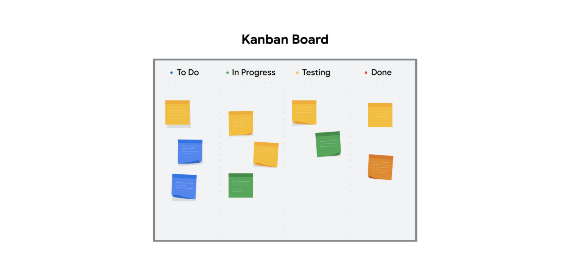

# Summary of the project phases
The project life cycle is the path for your project from start to finish. Each project phase builds toward the subsequent phase and helps to create a structure for the project. To recap, the main phases of the project life cycle are: initiating the project, making a plan, executing and completing tasks, and closing the project. 

In this reading, we will summarize each phase of the project life cycle. 

From left to right, this graphic shows each phase of the project management lifecycle as arrows, pointing to a target (goal).
## The project life cycle
### Initiate the project
In this phase, ask questions to help set the foundation for the project, such as:

* Who are the stakeholders?
* What are the client’s or customer’s goals?
* What is the purpose and mission of the project?
* What are the measurable objectives for the team?
* What is the project trying to improve? 
* When does this project need to be completed? 
* What skills and resources will the project require? 
* What will the project cost? What are the benefits?
* Project initiation is the first phase of the project management life cycle and in this stage, companies decide if the project is needed and how beneficial it will be for them. The two metrics that are used to judge a proposed project and determine the expectations from it are the business case and feasibility study.
## Make a plan
In this phase, make a plan to get your project from start to finish. 

* Create a detailed project plan. What are the major milestones? What tasks or deliverables make up each milestone?  
* Build out the schedule so you can properly manage the resources, budget, materials, and timeline. Here, you will create an itemized budget.
## Execute the project
In this phase, put all of your hard work from the first two phases into action. 

* Monitor your project team as they complete project tasks. 
* Break down any barriers that would slow or stop the team from completing tasks. 
* Help keep the team aware of schedule and deliverable expectations.
* Address weaknesses in your process or examine places where your team may need additional training to meet the project’s goals.
* Adapt to changes in the project as they arise.
## Close the project
In this phase, close out the project.

* Identify that your team has completed all of the requested outcomes. 
* Release your team so they can support other projects within the company.
* Take time with your team to celebrate your successes! 
* Pass off all remaining deliverables and get stakeholder approval.
* Document the lessons you and your team learned during the project.
* Reflect on ways to improve in the future.
Key takeaway
Each phase of the project life cycle has its own significance and reason for existing. By following the project life cycle, you’re ensuring that you are: 

* Capturing the expectations of your customer
* Setting your project up for success with a plan
* Executing project tasks and addressing any issues that arise 
* Closing out your project to capture any lessons learned.

  

# Waterfall and Agile Comparison

|  | Waterfall | Agile      |
| ----------- | ----------- | ----------- |
| Project manager's role | Project manager serves as an active leader by prioritizing and assigning tasks to team members.| Agile project manager (or Scrum Master) acts primarily as a facilitator, removing any barriers the team faces.    Team shares more responsibility in managing their own work.|
| Scope | Project deliverables and plans are well-established and documented in the early stages of initiating and planning.   Changes go through a formal change request process. | Planning happens in shorter iterations and focuses on delivering value quickly.   Subsequent iterations are adjusted in response to feedback or unforeseen issues. |
| Schedule | Follows a mostly linear path through the initiating, planning, executing, and closing phases of the project. | Time is organized into phases called Sprints. Each Sprint has a defined duration, with a set list of deliverables planned at the start of the Sprint. |
| Cost | Costs are kept under control by careful estimation up front and close monitoring throughout the life cycle of the project. | Costs and schedule could change with each iteration. |
| Quality | Project manager makes plans and clearly defines criteria to measure quality at the beginning of the project. | Team solicits ongoing stakeholder input and user feedback by testing products in the field and regularly implementing improvements. |
| Communication | Project manager continually communicates progress toward milestones and other key indicators to stakeholders, ensuring that the project is on track to meet the customer’s expectations. | Team is customer-focused, with consistent communication between users and the project team. |
| Stakeholders | Project manager continually manages and monitors stakeholder engagement to ensure the project is on track. | Team frequently provides deliverables to stakeholders throughout the project. Progress toward milestones is dependent upon stakeholder feedback. |

# Lean and Six Sigma methodologies

Previously you learned about Agile and Waterfall project management approaches. Now, we will define some key concepts from Lean and Six Sigma methodologies. We will learn how these methodologies can be used to organize and manage your projects, and we will discuss which is the most effective for different kinds of projects.   
**Lean**
Lean methodology is often referred to as Lean Manufacturing because it originated in the manufacturing world. The main principle in Lean methodology is the removal of waste within an operation. By optimizing process steps and eliminating waste, only value is added at each phase of production.  

- Today, the Lean Manufacturing methodology recognizes eight types of waste within an operation: defects, excess processing, overproduction, waiting, inventory, transportation, motion, and non-utilized talent. In the manufacturing industry, these types of waste are often attributed to issues such as: 
- Lack of proper documentation
- Lack of process standards
- Not understanding the customers’ needs
- Lack of effective communication
- Lack of process control
- Inefficient process design
- Failures of management

These same issues create waste in project management. 

Implement Lean project management when you want to use limited resources, reduce waste, and streamline processes to gain maximum benefits. 

You can achieve this by using the pillars of the Lean 5S quality tool. The term 5S refers to the five pillars that are required for good housekeeping: sort, set in order, shine, standardize, and sustain. Implementing the 5S method means cleaning up and organizing the workplace to achieve the smallest amount of wasted time and material. The 5S method includes these five steps: 

1. Sort: Remove all items not needed for current production operations and leave only the bare essentials. 
2. Set in order: Arrange needed items so that they are easy to use. Label items so that anyone can find them or put them away. 
3. Shine: Keep everything in the correct place. Clean your workspace every day.
4. Standardize: Perform the process in the same way every time. 
5. Sustain: Make a habit of maintaining correct procedures and instill this discipline in your team.

Within the Lean methodology, 5S helps you boost performance. 

The final concept of Lean uses a Kanban scheduling system to manage production. The Kanban scheduling system, or Kanban board, is a visualization tool that enables you to optimize the flow of your team’s work. It gives the team a visual display to identify what needs to be done and when. The Kanban board uses cards that are moved from left to right to show progress and help your team coordinate the work. 

Kanban boards and 5S are core principles of the Lean methodology. They can help you successfully manage your project. Now let’s analyze the Six Sigma method and learn when is the best time to use it. 

# Six Sigma
**Six Sigma** is a methodology used to reduce variations by ensuring that quality processes are followed every time. The term “Six Sigma” originates from statistics and generally means that items or processes should have 99.9996% quality.

The seven key principles of Six Sigma are:

1. Always focus on the customer.
2. Identify and understand how the work gets done. Understand how work really happens.
3. Make your processes flow smoothly.
4. Reduce waste and concentrate on value.
5. Stop defects by removing variation.
6. Involve and collaborate with your team.
7. Approach improvement activity in a systematic way.

Use this methodology to find aspects of the product or process that are measurable like time, cost, or quantity. Then inspect that measurable item and reject any products that do not meet the Six Sigma standard. Any process that created unacceptable products has to be improved upon.  

Now that you understand both Lean and Six Sigma, let's see how they come together to improve the performance of your project!

# Lean Six Sigma 
After both Lean and Six Sigma were put into practice, it was discovered that the two methodologies could be combined to increase benefits. The tools used in Lean, such as Kanban boards and 5S, build quality in processes from the beginning. Products developed using Lean methods are then inspected or tested using Six Sigma standards. The products that do not meet these standards are rejected. 

The largest difference between these methodologies is that Lean streamlines processes while Six Sigma reduces variation in products by building in quality from the beginning and inspecting products to ensure quality standards are met. You may find that one of these two methods—or using them both together—can improve the efficiency of your projects. 

# Common project management approaches and how to select one

You have been learning a lot about different project management approaches and when to use them. In this reading, we will briefly recap some of the most common ones and recommend a  couple of articles with supporting information. You’ll continue to learn more about these approaches throughout this certificate program. 

## Popular project management approaches
Below is a brief recap of some of the project management approaches you’ve been introduced to so far:

**Waterfall** is a traditional methodology in which tasks and phases are completed in a linear, sequential manner, and each stage of the project must be completed before the next begins. The project manager is responsible for prioritizing and assigning tasks to team members. In Waterfall, the criteria used to measure quality is clearly defined at the beginning of the project.

**Agile** involves short phases of collaborative, iterative work with frequent testing and regularly-implemented improvements. Some phases and tasks happen at the same time as others. In Agile projects, teams share responsibility for managing their own work. Scrum and Kanban are examples of Agile frameworks, which are specific development approaches based on the Agile philosophy.

**Scrum** focuses on developing, delivering, and sustaining complex project and products through collaboration, accountability, and an iterative process. Like many Agile frameworks, work is often completed by smaller, cross-functional teams and divided into short “Sprints” with a set list of deliverables.

**Kanban** is both an approach and a tool that provides visual feedback about the status of the work in progress through the use of Kanban boards or charts. With Kanban, project managers use sticky notes or note cards on a physical or digital Kanban board to represent the team’s tasks with categories like “To do,” “In progress,” and “Done.”

**Lean** uses the 5S quality tool to eliminate eight areas of waste, save money, improve quality, and streamline processes. Lean’s principles state that you can do more with less by addressing dysfunctions that create waste. Lean implements a Kanban scheduling system to manage production.

**Six Sigma** involves reducing variations by ensuring that quality processes are followed every time. The Six Sigma method follows a process-improvement approach called DMAIC, which stands for define, measure, analyze, improve, and control.

**Lean Six Sigma** is a combination of Lean and Six Sigma approaches. It is often used in projects that aim to save money, improve quality, and move through processes quickly. Lean Six Sigma is also ideal for solving complex or high-risk problems. The 5S quality tool, the DMAIC process, and the use of Kanban boards are all components of this approach. 

Despite their differences, all of these project management methodologies require communication and collaboration among various teams and aim to deliver projects on time and within budget. 

### Waterfall
- Following a linear path through the project phases is a Waterfall characteristic.Certain tasks must be completed before others can begin.
- The Waterfall as a methodology was created in the 1970s.
- Clearly defined project phases are a Waterfall characteristic.The project team should stick to the plan once the project begins.
- In Waterfall, the project manager makes plans and clearly defines criteria to measure quality at the beginning of the project.Because it is difficult to change the course of Waterfall projects in progress, they involve detailed advance planning.
- In Waterfall projects, the project manager is an active leader who prioritizes and assigns tasks to team members.The PM’s job is to lead the team through the linear progression of project phases.
- In Waterfall, change is often difficult to manage once the project begins.Because they are carried out in sequence, Waterfall projects are not very receptive to change.
- Project deliverables and plans are well-established and documented early on in Waterfall projects.The project begins only after goals, tasks, and schedules are approved.
### Agile / Scrum
- Agile involves organizing time into “Sprints” with a set list of deliverables.Some phases and tasks happen at the same time as others.
- The Agile methodology was created in the 1990s.
- Testing products in the field and regularly implementing improvements is an Agile characteristic.Feedback and testing can influence future work.
- In Agile projects, teams share responsibility for managing their own work.The project manager acts as a facilitator who removes barriers for the team.
- Agile projects are iterative, which makes them receptive to change.
- Planning happens in short iterations to deliver value quickly in agile projects.Planning each new Sprint as it arises makes for more flexible projects.
### Lean Six Sigma
- Lean Six Sigma uses a Kanban scheduling system to manage production.
- The Lean Six Sigma approach aims to eliminate 8 areas of waste.Reducing waste and increasing efficiency are core aspects of this methodology.
- Using the 5S quality tool is an Lean Six Sigma characteristic.The 5S tool helps teams use limited resources, reduce waste, and streamline processes.
- Lean Six Sigma is ideal for fixing complex or high-risk problems.
### Applies to all 3
- All methodologies can be combined with other approaches, depending on project needs.
- All methodologies aim to deliver the project on time and within budget.
- All methodologies require collaboration among various teams.Communication and working together across disciplines is key to every project’s success.

# A project manager’s role in change management
In the last video, you learned that the process of delivering your completed project and getting people to adopt it is called change management. Change management is a structured approach for dealing with change within an organization. 

### Two people looking at a chart
In this reading, we will discuss strategies for approaching change management as a project manager. Change management may be your responsibility to varying degrees on different projects. Your project’s success depends on the adoption and acceptance of your deliverable—whether that entails the launch of a new external tool or a process that will change operations at a production facility. In both cases, the greatest impact of the change will be on the people who use and interact with the product or process that is changing. For example, if your website’s user interface changes, the major impact of that change affects the user. The user must learn how the website has been reorganized and adapt to the new way to navigate it. 

### Changes are inevitable, but we are often resistant to them. You can help ensure your project’s success by embracing changes as they come and by convincing the wider audience to embrace changes too. When you implement a careful approach to change management, you can address issues that might occur in the later stages of your project.

### Integrating project management and change management
As a project manager, you can think of change management as necessary for the successful outcome of your project. Both change management and project management aim to increase the likelihood of project success and incorporate tools and processes to accomplish that goal. The most effective way to achieve a project goal is to integrate project management and change management, and it is your responsibility as a project manager to do so. Let’s look at a few ways you can approach change management on your projects:

- Be proactive: Incorporate change management into your project management steps. For example, you can schedule documentation reviews periodically to ensure that your team members know there is a place to voice their suggestions and concerns. You can also plan steps towards the end of your project to introduce the deliverable to users in the form of demonstrations, question and answer forums, or marketing videos. You can factor all of these decisions into your plan so that any potential changes are less likely to impact your timeline. If these steps have not been built into your plan, you can escalate and stress the importance of a change management plan to your stakeholders. Proactive and inclusive change management planning can help keep any potentially impacted stakeholders aware of the upcoming changes.
- Communicate: Maintaining communication about upcoming changes are vital to ensuring successful change management. Communication should occur regularly among impacted stakeholders, the change management team, and the project team. 
Follow a consistent process: Following a clear change management process helps maintain consistency each time there is a change. The change management process should be established and documented early on in your project to guide how the project will handle change. Your organization may also have an overarching change management plan that can be adopted for your project. This may include when the promotion of the change should happen, when training should occur, when the launch or release will occur, and corresponding steps for each phase of the process. 
- Use tools: Incorporating tools to assist in the adoption of a change can be very helpful. Let's examine a few examples you can use on your next project. Feedback mechanisms, such as surveys, can capture input from stakeholders. Flowcharts can visualize the project's development process. Culture mapping can illustrate the company's culture and how the company's values, norms, and employees behavior may be affected by the change.
As the project manager, you are responsible for successfully delivering projects. As you hone the skill set you acquire throughout this program, you will find that change management is essential to your projects’ success.

# Corporate and project governance
Governance in business is the management framework within which decisions are made and accountability and responsibility are determined. In simple terms, governance is understanding who is in charge. In this reading, we will discuss corporate governance and project governance. It is important to learn how corporate and project governance are related since you may have to speak about governance in an interview. Additionally, you will need to understand how your project relates to the governance structure of the organization.

## Corporate governance
Each organization is governed by its own set of standards and practices that direct and control its actions. Those standards and practices are called corporate governance, and they will influence your projects. Corporate governance is the framework by which an organization achieves its goals and objectives. Corporate governance is also a way to balance the requirements of the various corporate entities, such as stakeholders, management, and customers. Corporate governance affects every part of an organization, including action plans, internal and external controls, and performance measurements.

Governance and change management go hand-in-hand. Think back to the previous videos on change management. To successfully implement change management, it is essential that you understand the structure and culture of the organization. Effective governance in change management provides clearly defined roles and responsibilities during change. This enables the people within the organization to have a precise understanding of who makes decisions and of the relationship between those managing and participating in the change management process. 

Another example of governance within an organization is the creation and use of steering committees. Steering committees decide on the priorities of an organization and manage the general course of its operations. The steering committee essentially acts as an advisory board or council to help the project manager and the company make and approve strategic decisions that affect both the company and the project. 

## Project governance
As a project manager, you will be responsible for project governance. Project governance is the framework for how project decisions are made. Project governance helps keep projects running smoothly, on time, and within budget. Project governance involves all the key elements that make a project successful. It tells you what activities an organization does and who is responsible for those activities. Project governance covers policies, regulations, functions, processes, procedures, and responsibilities. 

## How project and corporate governance intersect
Project governance needs to be tailored to your organization's specific needs. These needs will influence how you implement and monitor the governance framework on your project. Project governance concerns those areas of corporate governance that are specifically related to project activities. Effective project governance ensures that an organization’s projects are aligned to the organization’s larger objectives, are delivered efficiently, and are sustainable. This includes:

- Considering the long- and short-term interests of your organization
- Making thoughtful decisions about which projects to take on and avoiding projects if you do not have sufficient resources
- Providing timely, relevant, and reliable information to the board of directors and other major stakeholders 
- Eliciting the input and buy-in of senior managers since they are the decision-makers 
- During the initiation phase, prioritizing clear, reachable, and sustainable goals in order to reduce confusion and conflict
- During the planning phase, assigning ownership and accountability to an experienced team to deliver, monitor, and control the process 
- During the execution phase, learning from mistakes and adapting to new or improved knowledge
- Corporate governance can involve clearing many hurdles before making decisions. These decisions can influence not only a single project, but the entire corporation. 

At the same time, corporate governance can help support project governance, as it provides oversight on compliance and mitigating risk and offers guidance and direction for project managers. Good corporate governance can also help project managers secure resources, get issues addressed, avoid delays in decision-making, get buy-in from stakeholders, and achieve visibility for projects on the executive level.

Key takeaway
You should think about an organization’s culture and structure when you are interviewing for a new role and as you begin a new role or project. You should consider an organization’s governance processes and practices in the same way. This will help you understand how decisions are made, who is responsible for what, and what are the potential issues and areas of concern. 